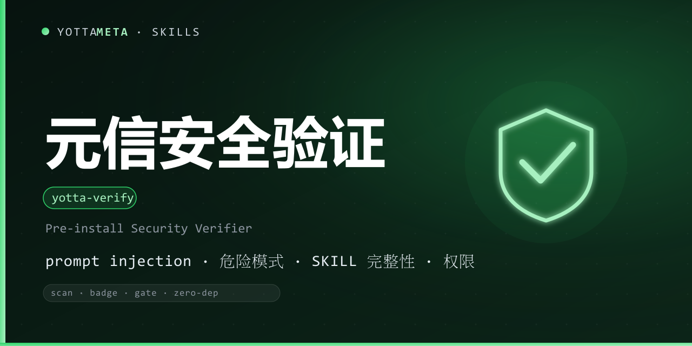

<p align="center"><b>Language</b>: English · <a href="./README.zh-CN.md">中文</a></p>

<p align="center">
  
</p>

<h1 align="center">yotta-verify · 元信 (YuanXin)</h1>

<p align="center">YottaMeta's <b>pre-install security verifier</b> for Agent skills: before you install any skill or npm package, it runs a <b>deterministic static scan</b> — prompt injection, malicious patterns, SKILL.md integrity and permissions — then outputs a one-line <b>verdict</b> and an <b>audited badge</b>.</p>
<p align="center">Activates before installing / evaluating any skill, generating an audited badge, or adding a CI pre-install gate.</p>
<p align="center">Zero dependencies (Python 3.8+ standard library); Windows + Linux + macOS; fully local and offline — no network calls, no execution of the scanned code.</p>

<p align="center">
  <a href="LICENSE"></a>
  <a href="https://agentskills.io/"></a>
  <a href="https://www.npmjs.com/package/@yottameta/yotta-verify"></a>
  <a href="https://github.com/YottaMeta/yotta-verify"></a>
  <a href="https://github.com/YottaMeta/yotta-verify/commits/main"></a>
  <a href="https://github.com/YottaMeta/yotta-verify"></a>
</p>

## What it is

The skill market has a trust problem: a 2025 survey of 22,511 skills found 140,963 issues, and **36% contain prompt injection**. YuanXin gives you a **deterministic answer before you install**: it scans the skill directory / npm tarball locally and reports what was found, how severe it is, and whether it is safe to install.

It is a **pre-install verifier**, not a sandbox and not a runtime monitor: it only reads files and prints a report. It never executes the scanned code, never connects to the network, and never fixes anything.

## Core value

- **Deterministic static scan** — four blocks: prompt injection, malicious patterns, SKILL.md integrity, permission needs.
- **Prompt injection detection** — 8 categories / 28 rules (instruction override, role spoofing, encoded instructions, data exfiltration, delimiter escape, tool self-execution, hidden intent, credential harvesting) plus a base64-decoding heuristic.
- **Shared malicious-pattern rules** — 54 rules kept in sync with yotta-security-audit (download-and-exec, obfuscation, persistence, exfiltration, credential theft, network calls, privilege escalation, social engineering).
- **One-line verdict** — SAFE TO INSTALL / REVIEW REQUIRED / INSTALL WITH CAUTION / DO NOT INSTALL, with exit codes aligned to yotta-security-audit and yotta-vetter.
- **Audited badge** — local SVG + shields.io URL; merges validate-skill result, yotta-vetter / yotta-security-audit verdicts, version and engine test count.
- **CI gate** — fail the pipeline when severity exceeds a threshold.

## Why use it

| Advantage | Description |
|---|---|
| **Trust before install** | A deterministic verdict for any skill, instead of "trust me" |
| **Zero dependency** | Python 3.8+ standard library; no daemon / database / network |
| **Fully local offline** | Scans directories and npm tarballs on disk; nothing is executed or uploaded |
| **Works with any skill** | Agent skills, npm packages, downloaded ZIPs — point it at a folder |
| **Family synergy** | Malicious-pattern rules shared with yotta-security-audit; verdicts can merge with yotta-vetter / yotta-security-audit |
| **Free core + Pro** | The whole scanner is free; Pro adds advanced heuristics, batch scans and enterprise reports |

## Commands

| Command | Description |
|---|---|
| scan | Pre-install scan (injection + malicious patterns + SKILL.md integrity + permissions) |
| scan --json | Structured scan result |
| scan --report report.md | Write a SKILL VERIFY REPORT (Markdown) |
| scan --badge | Generate the audited badge together with the scan |
| badge | Generate an audited badge (local SVG + shields.io URL) |
| report | Generate a verification report (Markdown / JSON) |
| gate | CI pre-install gate (default threshold: medium) |
| --version | Print version |

## Usage

Windows uses `python`, Linux/macOS uses `python3`.

```bash
# Scan a skill directory before installing
python3 scripts/yotta_verify.py scan ./some-skill

# JSON + Markdown report + audited badge
python3 scripts/yotta_verify.py scan ./some-skill --json --report report.md --badge

# Audited badge with merged external verdicts
python3 scripts/yotta_verify.py badge ./some-skill --validate-skill pass     --vetter-verdict "SAFE TO INSTALL" --audit-verdict "SAFE TO INSTALL" --tests 52

# CI gate: fail if the worst severity exceeds medium
python3 scripts/yotta_verify.py gate ./some-skill --max-severity medium
```

Exit codes: **0** = SAFE TO INSTALL; **1** = REVIEW REQUIRED; **2** = INSTALL WITH CAUTION;
**3** = DO NOT INSTALL; **4** = usage / read error.

Sample text output:

```
元信 yotta-verify v0.1.1 —— 装前安全扫描
目标：./some-skill（扫描 14 个文件）

verdict: SAFE TO INSTALL
发现：critical 0 / high 0 / medium 0 / low 2 / info 1
```

## Installation

Pick any of the four methods below; the order is the recommended priority. Skill files always come from **npm** (GitHub can be slow without a proxy; npm supports mirrors).

### Method 1: npm one-liner (recommended)

```text
# Optional China mirror: npm config set registry https://registry.npmmirror.com
npx -y @yottameta/yotta-verify --agent <agent-name>      # install to the agent's default user-level skills dir
npx -y @yottameta/yotta-verify --dir <your-skills-dir>   # point to the skills dir itself (e.g. ~/.codex/skills)
```

- `--agent <name>` installs to that agent's default user-level directory; `--list` shows each agent's default directory.
- `--dir <path>` installs to the given directory; for agents not in the preset list, point `--dir` at their skills directory.
- If the mirror has not synced the new package (404): add `--registry=https://registry.npmjs.org/` (a proxy may be needed in China), or wait for the mirror cache.

### Method 2: git clone (developers / git available)

```text
git clone https://github.com/YottaMeta/yotta-verify.git <your-skills-dir>/yotta-verify
```

### Method 3: GitHub Download ZIP (manual / no git)

On the GitHub repository `YottaMeta/yotta-verify`, click **Code → Download ZIP**, unzip it and put the `yotta-verify` folder into the agent's skills directory.

### Method 4: install.sh (multi-agent one-liner script)

```text
bash install.sh --agent <name>   # install to the agent's default user-level directory
bash install.sh --dir <path>     # install to the given directory
bash install.sh --list           # list agents -> default directories
```

> Method 1 uses the npm registry (npmmirror / npmjs) and does not depend on GitHub; Methods 2/3 use GitHub and may fail without a proxy in China.

## Development & validation

The package ships its own test suite (included in the published package):

```bash
# Run the full suite (52 cases) from the skill directory
python scripts/test_yotta_verify.py
```

References: `references/injection-patterns.md` (detection patterns), `references/verify-report-template.md` (report template), `references/badges.md` (badge guide).

## License

MIT © YottaMeta — see [LICENSE](./LICENSE).
